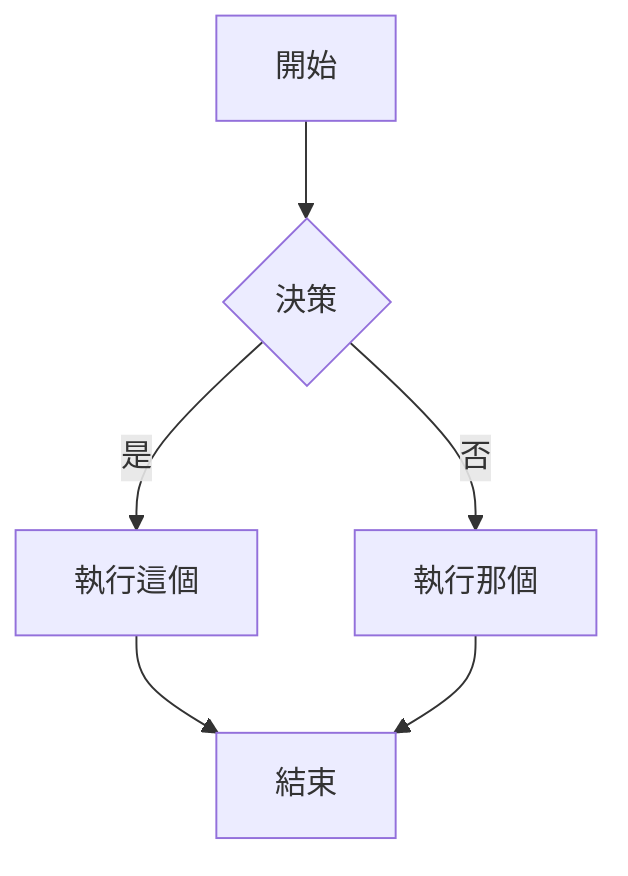
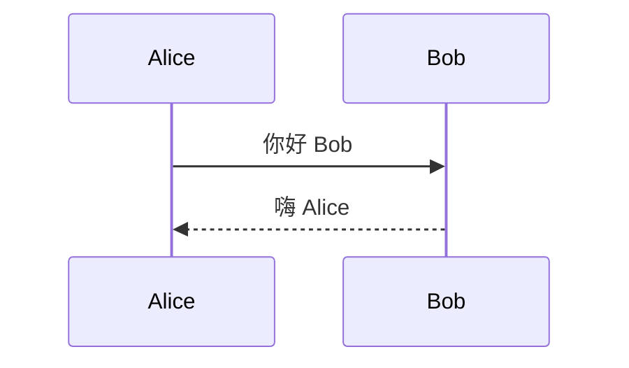
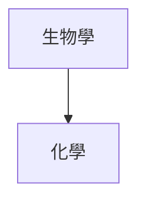
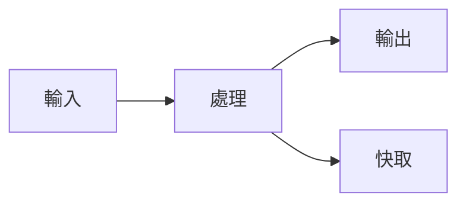

# Obsidian Flavored Markdown 技能

此技能讓相容的代理程式能夠建立和編輯有效的 Obsidian Flavored Markdown，包括所有 Obsidian 特定語法擴充。

## 概述

Obsidian 使用多種 Markdown 風格的組合：
- [CommonMark](https://commonmark.org/)
- [GitHub Flavored Markdown](https://github.github.com/gfm/)
- [LaTeX](https://www.latex-project.org/) 用於數學
- Obsidian 特定擴充（wikilinks、callouts、嵌入等）

## 基本格式化

### 段落和換行

```markdown
這是一個段落。

這是另一個段落（段落間的空行建立獨立段落）。

段落內換行，在行尾加兩個空格  
或使用 Shift+Enter。
```

### 標題

```markdown
# 標題 1
## 標題 2
### 標題 3
#### 標題 4
##### 標題 5
###### 標題 6
```

### 文字格式化

| 風格 | 語法 | 範例 | 輸出 |
|-------|--------|---------|--------|
| 粗體 | `**text**` 或 `__text__` | `**粗體**` | **粗體** |
| 斜體 | `*text*` 或 `_text_` | `*斜體*` | *斜體* |
| 粗體 + 斜體 | `***text***` | `***兩者***` | ***兩者*** |
| 刪除線 | `~~text~~` | `~~刪除~~` | ~~刪除~~ |
| 高亮 | `==text==` | `==高亮==` | ==高亮== |
| 內文程式碼 | `` `code` `` | `` `code` `` | `code` |

### 跳脫格式化

使用反斜線跳脫特殊字元：
```markdown
\*這不會是斜體\*
\#這不會是標題
1\. 這不會是列表項目
```

常見需要跳脫的字元：`\*`、`\_`、`\#`、`` \` ``、`\|`、`\~`

## 內部連結（Wikilinks）

### 基本連結

```markdown
[[筆記名稱]]
[[筆記名稱.md]]
[[筆記名稱|顯示文字]]
```

### 連結到標題

```markdown
[[筆記名稱#標題]]
[[筆記名稱#標題|自訂文字]]
[[#同一筆記中的標題]]
[[##搜尋儲存庫中所有標題]]
```

### 連結到區塊

```markdown
[[筆記名稱#^block-id]]
[[筆記名稱#^block-id|自訂文字]]
```

在段落末尾添加 `^block-id` 來定義區塊 ID：
```markdown
這是可以連結的段落。 ^my-block-id
```

對於列表和引用，在單獨一行添加區塊 ID：
```markdown
> 這是一個引用
> 有多行

^quote-id
```

### 搜尋連結

```markdown
[[##heading]]     搜尋包含 "heading" 的標題
[[^^block]]       搜尋包含 "block" 的區塊
```

## Markdown 風格連結

```markdown
[顯示文字](Note%20Name.md)
[顯示文字](Note%20Name.md#標題)
[顯示文字](https://example.com)
[筆記](obsidian://open?vault=VaultName&file=Note.md)
```

注意：在 Markdown 連結中，空格必須 URL 編碼為 `%20`。

## 嵌入

### 嵌入筆記

```markdown
![[筆記名稱]]
![[筆記名稱#標題]]
![[筆記名稱#^block-id]]
```

### 嵌入圖片

```markdown
![[image.png]]
![[image.png|640x480]]    寬度 x 高度
![[image.png|300]]        僅寬度（保持寬高比）
```

### 外部圖片

```markdown


```

### 嵌入音訊

```markdown
![[audio.mp3]]
![[audio.ogg]]
```

### 嵌入 PDF

```markdown
![[document.pdf]]
![[document.pdf#page=3]]
![[document.pdf#height=400]]
```

### 嵌入列表

```markdown
![[筆記#^list-id]]
```

其中列表已用區塊 ID 定義：
```markdown
- 項目 1
- 項目 2
- 項目 3

^list-id
```

### 嵌入搜尋結果

````markdown
```query
tag:#project status:done
```
````

## Callouts

### 基本 Callout

```markdown
> [!note]
> 這是一個註解 callout。

> [!info] 自訂標題
> 這個 callout 有自訂標題。

> [!tip] 僅標題
```

### 可折疊 Callouts

```markdown
> [!faq]- 預設折疊
> 這些內容在展開前隱藏。

> [!faq]+ 預設展開
> 這些內容可見但可以折疊。
```

### 巢狀 Callouts

```markdown
> [!question] 外層 callout
> > [!note] 內層 callout
> > 巢狀內容
```

### 支援的 Callout 類型

| 類型 | 別名 | 描述 |
|------|---------|-------------|
| `note` | - | 藍色，鉛筆圖示 |
| `abstract` | `summary`, `tldr` | 青色，剪貼板圖示 |
| `info` | - | 藍色，資訊圖示 |
| `todo` | - | 藍色，核取方塊圖示 |
| `tip` | `hint`, `important` | 青色，火焰圖示 |
| `success` | `check`, `done` | 綠色，勾號圖示 |
| `question` | `help`, `faq` | 黃色，問號 |
| `warning` | `caution`, `attention` | 橙色，警告圖示 |
| `failure` | `fail`, `missing` | 紅色，X 圖示 |
| `danger` | `error` | 紅色，閃電圖示 |
| `bug` | - | 紅色，臭蟲圖示 |
| `example` | - | 紫色，列表圖示 |
| `quote` | `cite` | 灰色，引用圖示 |

### 自訂 Callouts（CSS）

```css
.callout[data-callout="custom-type"] {
  --callout-color: 255, 0, 0;
  --callout-icon: lucide-alert-circle;
}
```

## 列表

### 無序列表

```markdown
- 項目 1
- 項目 2
  - 巢狀項目
  - 另一個巢狀
- 項目 3

* 也適用於星號
+ 或加號
```

### 有序列表

```markdown
1. 第一個項目
2. 第二個項目
   1. 巢狀編號
   2. 另一個巢狀
3. 第三個項目

1) 替代語法
2) 使用括號
```

### 任務列表

```markdown
- [ ] 未完成任務
- [x] 已完成任務
- [ ] 有子任務的任務
  - [ ] 子任務 1
  - [x] 子任務 2
```

## 引用

```markdown
> 這是一個區塊引用。
> 可以跨越多行。
>
> 並包含多個段落。
>
> > 巢狀引用也有效。
```

## 程式碼

### 內文程式碼

```markdown
使用 `反引號` 作為內文程式碼。
使用雙反引號處理 ``包含 ` 反引號的程式碼``。
```

### 程式碼區塊

````markdown
```
純程式碼區塊
```

```javascript
// 語法高亮的程式碼區塊
function hello() {
  console.log("Hello, world!");
}
```

```python
# Python 範例
def greet(name):
    print(f"Hello, {name}!")
```
````

### 巢狀程式碼區塊

對外層區塊使用更多反引號或波浪號：

`````markdown
````markdown
這裡是如何建立程式碼區塊：
```js
console.log("Hello")
```
````
`````

## 表格

```markdown
| 標題 1 | 標題 2 | 標題 3 |
|----------|----------|----------|
| 儲存格 1   | 儲存格 2   | 儲存格 3   |
| 儲存格 4   | 儲存格 5   | 儲存格 6   |
```

### 對齊

```markdown
| 左對齊     | 置中對齊   | 右對齊    |
|:---------|:--------:|---------:|
| 左對齊     | 置中對齊   | 右對齊    |
```

### 在表格中使用管道符號

用反斜線跳脫管道符號：
```markdown
| 欄位 1 | 欄位 2 |
|----------|----------|
| [[連結\|顯示]] | ![[圖片\|100]] |
```

## 數學（LaTeX）

### 內文數學

```markdown
這是內文數學：$e^{i\pi} + 1 = 0$
```

### 區塊數學

```markdown
$$
\begin{vmatrix}
a & b \\
c & d
\end{vmatrix} = ad - bc
$$
```

### 常見數學語法

```markdown
$x^2$              上標
$x_i$              下標
$\frac{a}{b}$      分數
$\sqrt{x}$         平方根
$\sum_{i=1}^{n}$   總和
$\int_a^b$         積分
$\alpha, \beta$    希臘字母
```

## 圖表（Mermaid）

````markdown

````

### 序列圖

````markdown

````

### 圖表中的連結

````markdown

````

## 註腳

```markdown
這個句子有註腳[^1]。

[^1]: 這是註腳內容。

您也可以使用命名註腳[^note]。

[^note]: 命名註腳仍顯示為數字。

也支援內文註腳。^[這是一個內文註腳。]
```

## 註解

```markdown
這是可見的 %%但這是隱藏的%% 文字。

%%
整個區塊都隱藏。
不會在閱讀檢視中出現。
%%
```

## 水平分隔線

```markdown
---
***
___
- - -
* * *
```

## 屬性（Frontmatter）

屬性在筆記開頭使用 YAML frontmatter：

```yaml
---
title: 我的筆記標題
date: 2024-01-15
tags:
  - project
  - important
aliases:
  - 我的筆記
  - 替代名稱
cssclasses:
  - custom-class
status: in-progress
rating: 4.5
completed: false
due: 2024-02-01T14:30:00
---
```

### 屬性類型

| 類型 | 範例 |
|------|---------|
| 文字 | `title: 我的標題` |
| 數字 | `rating: 4.5` |
| 核取方塊 | `completed: true` |
| 日期 | `date: 2024-01-15` |
| 日期和時間 | `due: 2024-01-15T14:30:00` |
| 列表 | `tags: [one, two]` 或 YAML 列表 |
| 連結 | `related: "[[其他筆記]]"` |

### 預設屬性

- `tags` - 筆記標籤
- `aliases` - 筆記的替代名稱
- `cssclasses` - 應用於筆記的 CSS 類別

## 標籤

```markdown
#標籤
#巢狀/標籤
#帶連字號的標籤
#帶底線的標籤

在 frontmatter 中：
---
tags:
  - tag1
  - nested/tag2
---
```

標籤可以包含：
- 字母（任何語言）
- 數字（不作为第一個字元）
- 底線 `_`
- 連字號 `-`
- 斜線 `/`（用於巢狀）

## HTML 內容

Obsidian 支援 Markdown 中的 HTML：

```markdown
<div class="custom-container">
  <span style="color: red;">彩色文字</span>
</div>

<details>
  <summary>點擊展開</summary>
  隱藏內容在這裡。
</details>

<kbd>Ctrl</kbd> + <kbd>C</kbd>
```

## 完整範例

````markdown
---
title: 專案 Alpha
date: 2024-01-15
tags:
  - project
  - active
status: in-progress
priority: high
---

# 專案 Alpha

## 概述

此專案旨在使用現代技術 [[改善工作流程]]。

> [!important] 關鍵截止日期
> 第一個里程碑截止日期為 ==1 月 30 日==。

## 任務

- [x] 初始規劃
- [x] 資源分配
- [ ] 開發階段
  - [ ] 後端實作
  - [ ] 前端設計
- [ ] 測試
- [ ] 部署

## 技術筆記

主要演算法使用公式 $O(n \log n)$ 進行排序。

```python
def process_data(items):
    return sorted(items, key=lambda x: x.priority)
```

## 架構



## 相關文件

- ![[會議記錄 2024-01-10#決策]]
- [[預算分配|預算]]
- [[團隊成員]]

## 參考資料

更多詳情請參閱官方文件[^1]。

[^1]: https://example.com/docs

%%
內部註記：
- 週五與團隊審查
- 考慮替代方法
%%
````

## 參考資料

- [基本格式化語法](https://help.obsidian.md/syntax)
- [進階格式化語法](https://help.obsidian.md/advanced-syntax)
- [Obsidian Flavored Markdown](https://help.obsidian.md/obsidian-flavored-markdown)
- [內部連結](https://help.obsidian.md/links)
- [嵌入檔案](https://help.obsidian.md/embeds)
- [Callouts](https://help.obsidian.md/callouts)
- [屬性](https://help.obsidian.md/properties)

## 報告
在解釋 markdown 語法或向使用者提供回饋時，您**必須**使用**繁體中文**。
